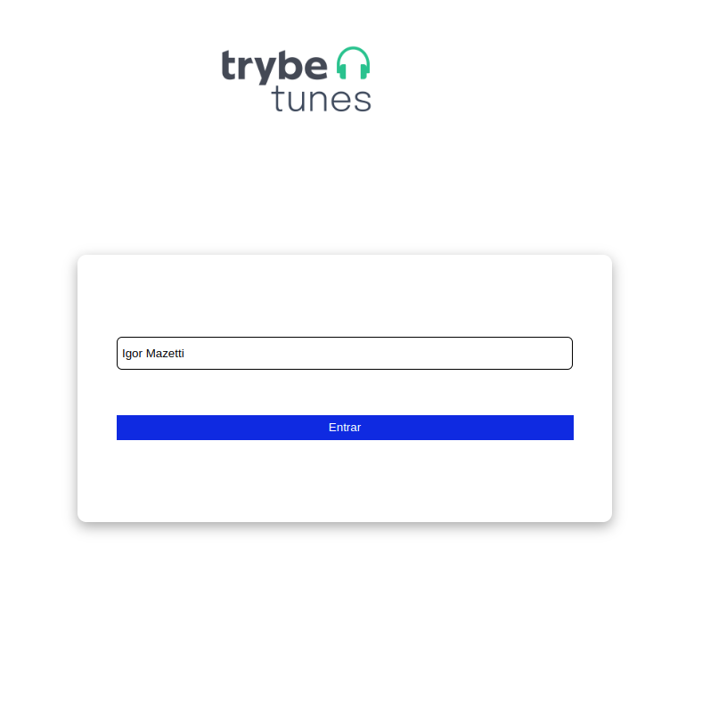
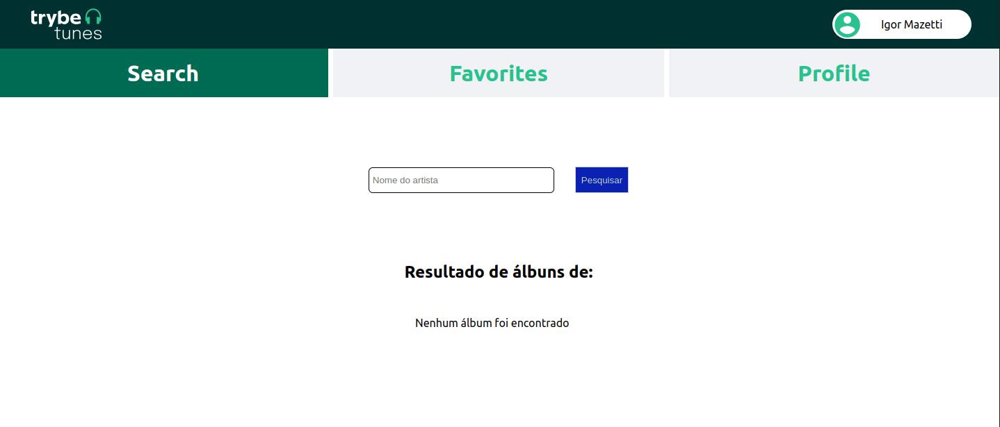
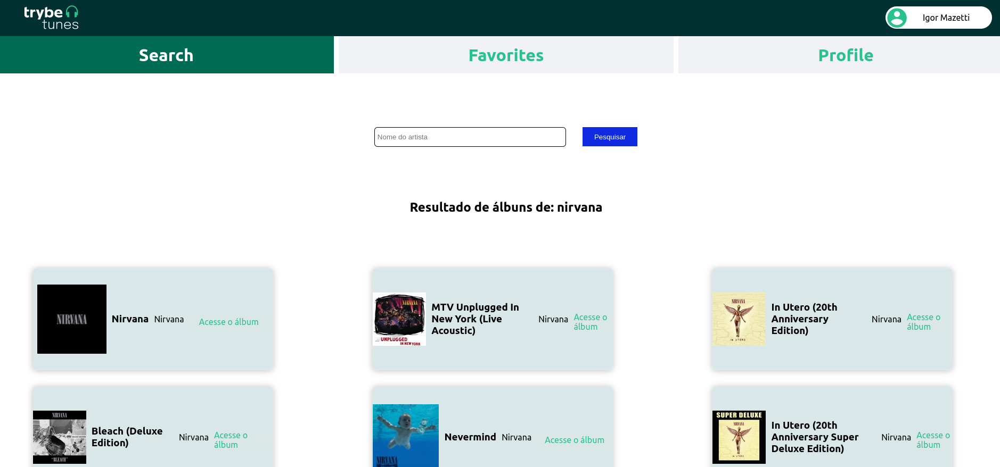
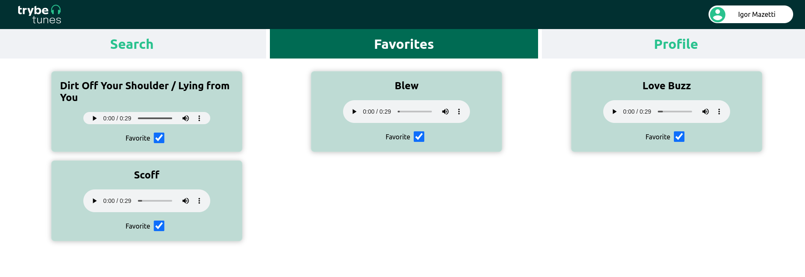

# Projeto TrybeTunes

Ese projeto foi desenvolvido durante o curso da Trybe no módulo de Front-End, em React.JS.

  

  

  

  

## Sobre o projeto:

Desenvolvi este projeto utilizando componentes de classe, trabalhando com estados e props,
além do consumo de API.

Não utilizei nenhum gerenciador de estados, pois o intuito era perceber a dificuldade gerada
no projeto sem a utilização de Redux ou outro gerenciador de estado.

## Como rodar o projeto:

Clone este repositório.

No terminal do projeto, rode os seguintes comandos:

npm install, depois npm start.

Vá até a URL http://localhost:3000 para ver o projeto no browser.

---

Feito por Igor Mazetti 👋 [Veja meu LinkedIn](https://www.linkedin.com/in/igor-mazetti-de-azevedo-147679ba/)